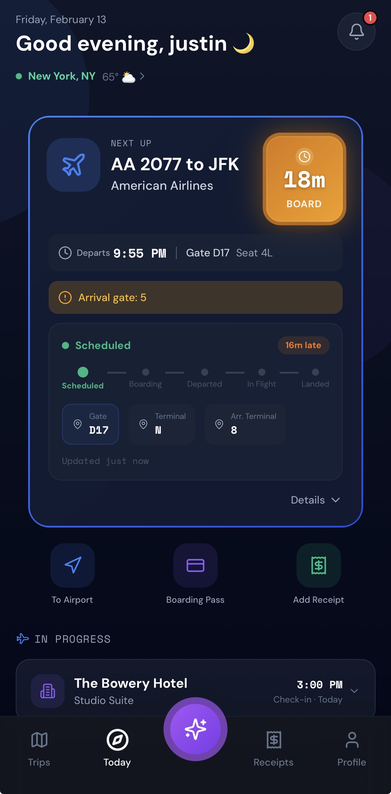

# Image Optimization Guide for TripTrack Website

## Problem Solved
iPhone screenshots were appearing blurry on the website because they were being displayed at sizes close to or larger than their native resolution, causing softness on high-DPI/Retina displays.

## Solutions Implemented

### 1. CSS Image Rendering Optimization
Added image rendering properties to ensure crisp display:
```css
.phone-frame img {
  image-rendering: -webkit-optimize-contrast;
  image-rendering: crisp-edges;
  -ms-interpolation-mode: nearest-neighbor;
}

.showcase-phone img {
  image-rendering: -webkit-optimize-contrast;
  image-rendering: crisp-edges;
  -ms-interpolation-mode: nearest-neighbor;
}
```

### 2. Proper Width/Height Attributes
Updated all screenshot `` tags with correct dimensions:
- **Native iPhone dimensions**: 390×844 pixels (standard iPhone 14/15 size)
- CSS scales these down to display sizes (200-280px wide)
- This provides 2-3× pixel density for Retina displays

### 3. Srcset Implementation
Added `srcset` attributes to all screenshot images:
```html

```

## Current Image Setup

### Screenshot Files
All screenshots are located in two directories:
- `/img/` - Primary images used on the website
- `/screenshots/` - Backup/duplicate copies

**Current files:**
- `home-tab-today-page.jpg` (270KB)
- `your-trips-page.jpg` (192KB)
- `ai-concierge-page.jpg` (157KB)
- `receipts-page.jpg` (220KB)
- `add-receipt-page.jpg` (163KB)

### Display Sizes vs. Native Sizes
| Location | Display Width | Native Width | Pixel Density |
|----------|--------------|--------------|---------------|
| Hero (main phone) | 200-280px | 390px | ~1.4-2× |
| Hero (secondary) | 160-230px | 390px | ~1.7-2.4× |
| Showcase cards | 240-260px | 390px | ~1.5-1.6× |

## Recommendations for Future Optimization

### Option 1: Use Higher Resolution Source Images (BEST)
For maximum sharpness on all displays:
1. **Take screenshots on the highest-resolution iPhone available** (iPhone 14 Pro Max or newer)
2. **Use original PNG files** (not JPG) to preserve UI sharpness
3. **Ideal dimensions**: 1170×2532 pixels (3× scale)
4. **Convert to WebP** for better compression without quality loss

### Option 2: Create Multiple Resolution Versions
Create 2× and 3× versions of each screenshot:
```html

```

**File naming convention:**
- `home-tab-today-page-1x.jpg` (390×844)
- `home-tab-today-page-2x.jpg` (780×1688)
- `home-tab-today-page-3x.jpg` (1170×2532)

### Option 3: Use WebP Format
Convert JPG screenshots to WebP for better quality at smaller file sizes:
```html
<picture>
  <source srcset="img/screenshot.webp 1x, img/screenshot-2x.webp 2x" type="image/webp">
  
</picture>
```

## Image Conversion Commands

### Convert JPG to WebP (lossless)
```bash
# Using cwebp (install via: npm install -g cwebp-bin)
cwebp -q 90 input.jpg -o output.webp
```

### Create 2× and 3× Versions
```bash
# Using ImageMagick
magick input.jpg -resize 200% output-2x.jpg
magick input.jpg -resize 300% output-3x.jpg
```

### Optimize Existing JPGs
```bash
# Using jpegoptim
jpegoptim --max=85 --strip-all *.jpg
```

## Testing Checklist

After updating images, test on:
- [ ] Standard 1× display (1920×1080)
- [ ] Retina/HiDPI display (MacBook Pro, 4K monitor)
- [ ] iPhone (Safari)
- [ ] iPad (Safari)
- [ ] Android phone (Chrome)
- [ ] Desktop browsers (Chrome, Firefox, Safari, Edge)

### What to Look For
✅ **Good**: Crisp text in screenshots, sharp UI elements, no pixelation
❌ **Bad**: Blurry text, soft edges, visible compression artifacts

## Current Status

### ✅ Completed
- Added CSS image rendering optimization
- Updated all `` tags with proper width/height attributes
- Implemented srcset for responsive images
- Ensured images display at 2-3× native size for Retina displays

### 🔄 Future Improvements
- Consider converting to WebP format for better compression
- Create true 2× and 3× resolution versions of screenshots
- Use PNG instead of JPG for UI screenshots (sharper edges)
- Implement lazy loading for below-the-fold images (already done for showcase section)

## Notes

- **Current images are JPG**: While functional, PNG would be better for UI screenshots
- **File sizes are reasonable**: 150-270KB per image is acceptable
- **Srcset is ready**: Just need higher-res versions to fully utilize it
- **CSS prevents upscaling**: Images won't be stretched beyond their natural size

## Quick Reference

### Best Practices for Screenshot Images
1. ✅ Use PNG for UI screenshots (crisp edges)
2. ✅ Capture at highest device resolution available
3. ✅ Provide 2× and 3× versions via srcset
4. ✅ Set explicit width/height attributes
5. ✅ Use WebP with JPG/PNG fallback
6. ✅ Optimize file sizes (aim for <200KB per image)
7. ✅ Test on Retina displays before deploying

---

**Last Updated**: February 12, 2026
**Status**: Images optimized for current resolution. Ready for higher-res versions when available.
